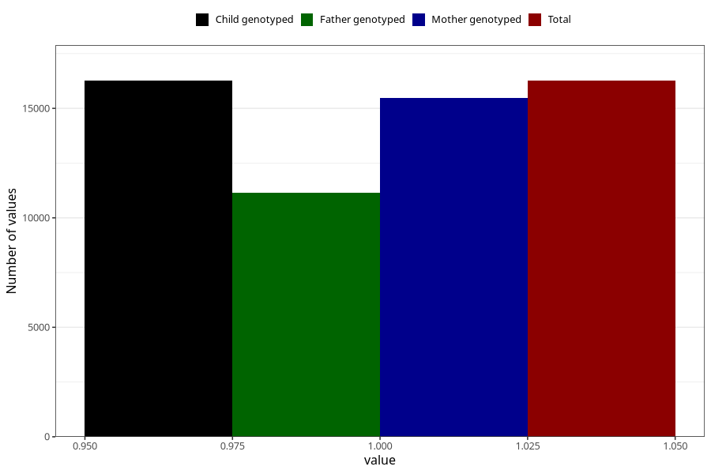

# contraception_used_condom
Variable mapping to `AA28` in `Skjema1_v12`.
- Number of values:

| Value | Total | Child genotyped | Mother genotyped | Father genotyped |
| ----- | ----- | --------------- | ---------------- | ---------------- |
| Missing | 59047 | 59047 | 56161 | 38946 |
| Non-missing | 16261 | 16261 | 15489 | 11138 |
| 1 | 16261 | 16261 | 15489 | 11138 |

