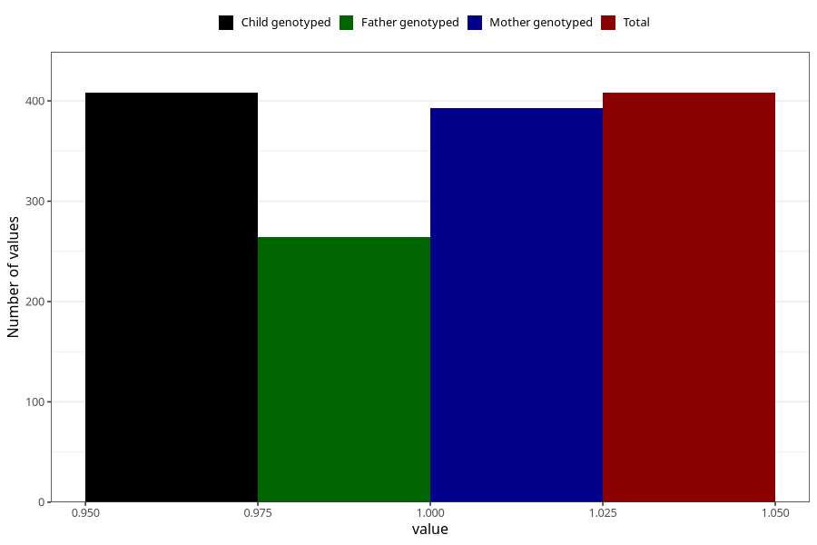

# contraception_used_hormone_injection
Variable mapping to `AA32` in `Skjema1_v12`.
- Number of values:

| Value | Total | Child genotyped | Mother genotyped | Father genotyped |
| ----- | ----- | --------------- | ---------------- | ---------------- |
| Missing | 74900 | 74900 | 71257 | 49820 |
| Non-missing | 408 | 408 | 393 | 264 |
| 1 | 408 | 408 | 393 | 264 |

