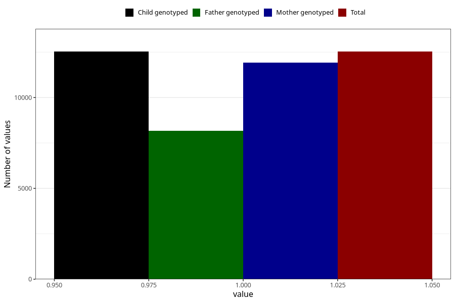

# contraception_used_no_such_method
Variable mapping to `AA38` in `Skjema1_v12`.
- Number of values:

| Value | Total | Child genotyped | Mother genotyped | Father genotyped |
| ----- | ----- | --------------- | ---------------- | ---------------- |
| Missing | 62780 | 62780 | 59739 | 41914 |
| Non-missing | 12528 | 12528 | 11911 | 8170 |
| 1 | 12528 | 12528 | 11911 | 8170 |

