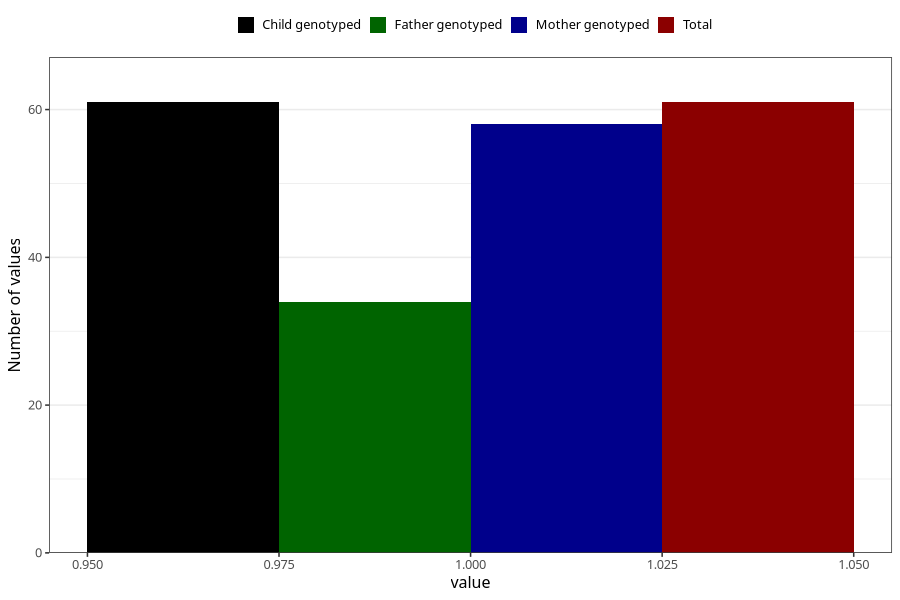

# contraception_used_spermicies
Variable mapping to `AA35` in `Skjema1_v12`.
- Number of values:

| Value | Total | Child genotyped | Mother genotyped | Father genotyped |
| ----- | ----- | --------------- | ---------------- | ---------------- |
| Missing | 75247 | 75247 | 71592 | 50050 |
| Non-missing | 61 | 61 | 58 | 34 |
| 1 | 61 | 61 | 58 | 34 |

