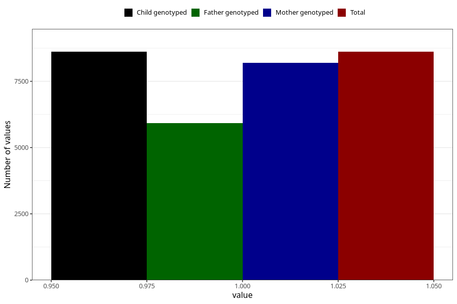

# lost_periods_previous_pregnancy
Variable mapping to `AA18` in `Skjema1_v12`.
- Number of values:

| Value | Total | Child genotyped | Mother genotyped | Father genotyped |
| ----- | ----- | --------------- | ---------------- | ---------------- |
| Missing | 66694 | 66694 | 63462 | 44159 |
| Non-missing | 8614 | 8614 | 8188 | 5925 |
| 1 | 8614 | 8614 | 8188 | 5925 |

