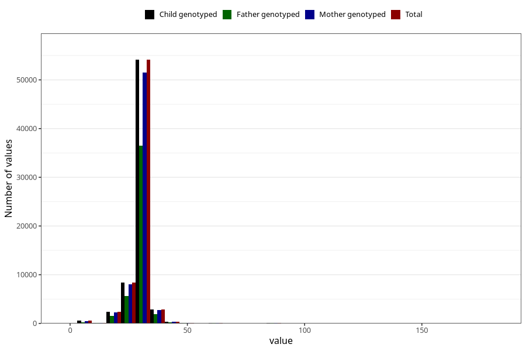

# menstrual_cycle_length
Variable mapping to `AA13` in `Skjema1_v12`.
Variable mapping to `AA13` in `Skjema1_v12`.
- Number of values:

| Value | Total | Child genotyped | Mother genotyped | Father genotyped |
| ----- | ----- | --------------- | ---------------- | ---------------- |
| Missing | 6141 | 6141 | 5838 | 3661 |
| Non-missing | 69167 | 69167 | 65812 | 46423 |
| 25th percentile | 28 | 28 | 28 | 28 |
| 50th percentile | 28 | 28 | 28 | 28 |
| 75th percentile | 30 | 30 | 30 | 30 |
| Mean | 28.5975682044906 | 28.5975682044906 | 28.5871573573209 | 28.6526290847209 |
| Standard deviation | 5.01404687779864 | 5.01404687779864 | 5.00194468480107 | 4.90260204370455 |
| N | 69167 | 69167 | 65812 | 46423 |

