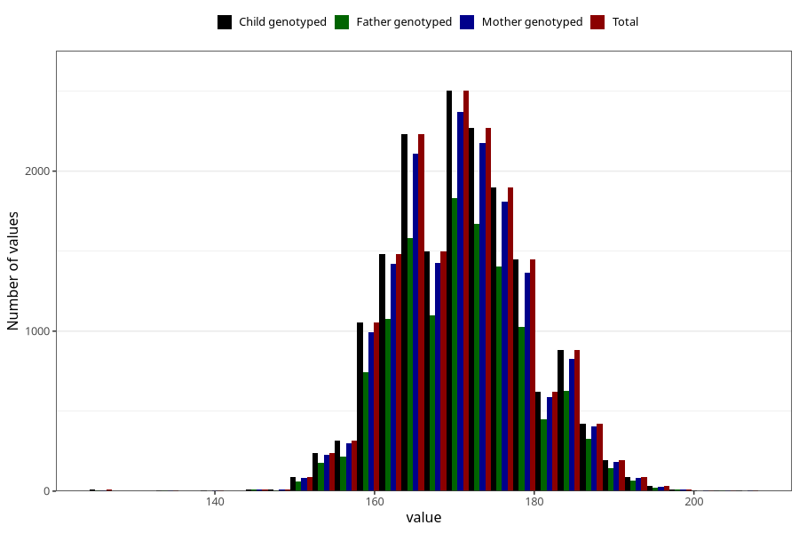

# height_14c
Variable mapping to `UB220` in `Ungdomsskjema_Barn_v12_standard`.
- Number of values:

| Value | Total | Child genotyped | Mother genotyped | Father genotyped |
| ----- | ----- | --------------- | ---------------- | ---------------- |
| Missing | 57982 | 57982 | 55186 | 37510 |
| Non-missing | 17326 | 17326 | 16464 | 12574 |
| 25th percentile | 165 | 165 | 165 | 165 |
| 50th percentile | 170 | 170 | 170 | 170 |
| 75th percentile | 176 | 176 | 176 | 176 |
| Mean | 170.896167609373 | 170.896167609373 | 170.894497084548 | 170.974630189279 |
| Standard deviation | 8.33310200728025 | 8.33310200728025 | 8.32449375181512 | 8.31120855391624 |
| N | 17326 | 17326 | 16464 | 12574 |

