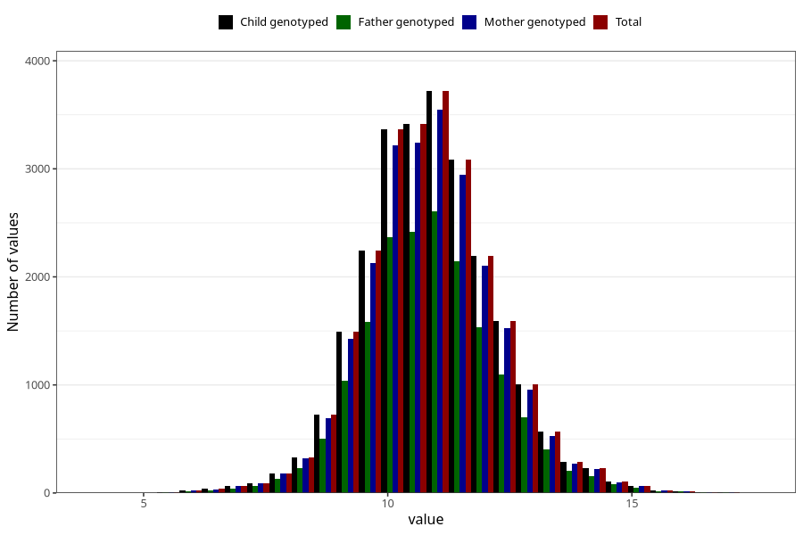

# weight_16m
Variable created during phenotype curation.
- Number of values:

| Value | Total | Child genotyped | Mother genotyped | Father genotyped |
| ----- | ----- | --------------- | ---------------- | ---------------- |
| Missing | 50423 | 50423 | 47917 | 32647 |
| Non-missing | 24885 | 24885 | 23733 | 17437 |
| 25th percentile | 10 | 10 | 10 | 10 |
| 50th percentile | 10.83 | 10.83 | 10.83 | 10.82 |
| 75th percentile | 11.7 | 11.7 | 11.7 | 11.7 |
| Mean | 10.8778433192686 | 10.8778433192686 | 10.8760127670332 | 10.8788249698916 |
| Standard deviation | 1.34319033777027 | 1.34319033777027 | 1.34234023649541 | 1.3436934672201 |
| N | 24885 | 24885 | 23733 | 17437 |

