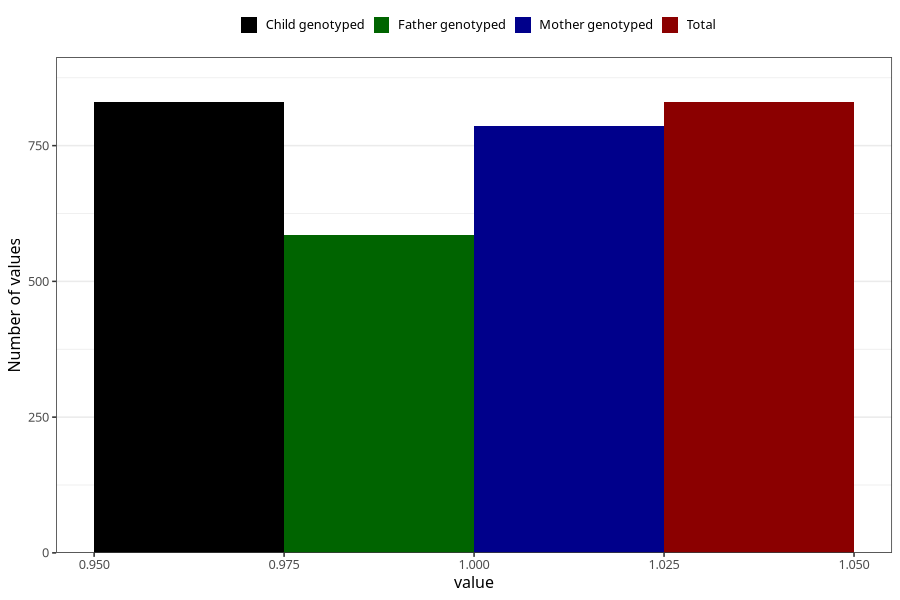

# other_longterm_illness_condition_previous_3y
Variable mapping to `GG115` in `Skjema6_3aar_v12`.
- Number of values:

| Value | Total | Child genotyped | Mother genotyped | Father genotyped |
| ----- | ----- | --------------- | ---------------- | ---------------- |
| Missing | 74478 | 74478 | 70864 | 49499 |
| Non-missing | 830 | 830 | 786 | 585 |
| 1 | 830 | 830 | 786 | 585 |

