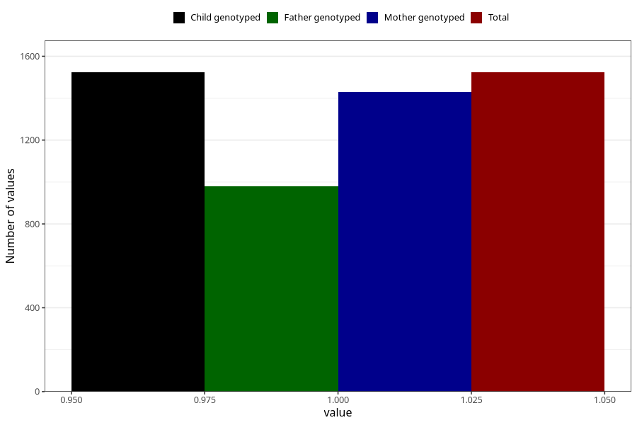

# vaginal_catarrh_unusual_discharge_5w_8w
Variable mapping to `AA247` in `Skjema1_v12`.
- Number of values:

| Value | Total | Child genotyped | Mother genotyped | Father genotyped |
| ----- | ----- | --------------- | ---------------- | ---------------- |
| Missing | 73785 | 73785 | 70220 | 49104 |
| Non-missing | 1523 | 1523 | 1430 | 980 |
| 1 | 1523 | 1523 | 1430 | 980 |

