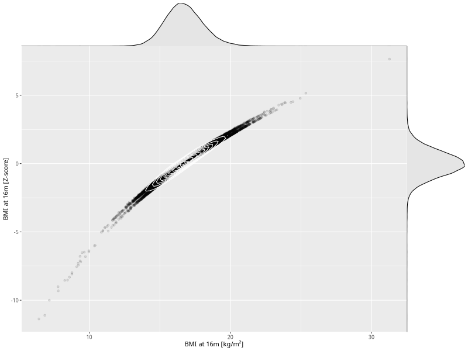

## BMI at 16m

| Name | # Children | # Mothers | # Fathers | # Total |
| ---- | ---------- | --------- | --------- | ------- |
| bmi_16m | 43656 | 41300 | 30409 | 115365 |
| z_bmi_16m | 43652 | 41296 | 30406 | 115354 |

- Formula: `bmi_16m ~ fp(pregnancy_duration_1)`
- Sigma formula: ` ~ pregnancy_duration_1`
- Distribution: `LOGNO`
- Normalization: `centiles.pred` Z-scores

