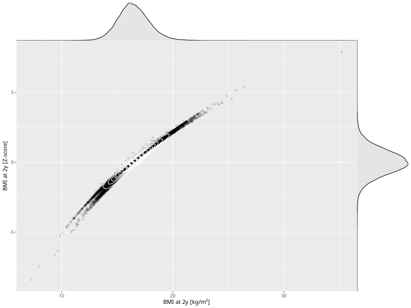

## BMI at 2y

| Name | # Children | # Mothers | # Fathers | # Total |
| ---- | ---------- | --------- | --------- | ------- |
| bmi_2y | 43394 | 41050 | 30229 | 114673 |
| z_bmi_2y | 43387 | 41043 | 30224 | 114654 |

- Formula: `bmi_2y ~ fp(pregnancy_duration_1)`
- Sigma formula: ` ~ pregnancy_duration_1`
- Distribution: `LOGNO`
- Normalization: `centiles.pred` Z-scores

