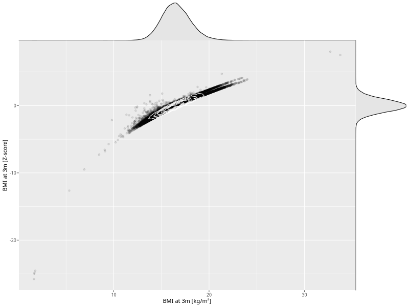

## BMI at 3m

| Name | # Children | # Mothers | # Fathers | # Total |
| ---- | ---------- | --------- | --------- | ------- |
| bmi_3m | 65588 | 62163 | 44016 | 171767 |
| z_bmi_3m | 65585 | 62160 | 44013 | 171758 |

- Formula: `bmi_3m ~ fp(pregnancy_duration_1)`
- Sigma formula: ` ~ pregnancy_duration_1`
- Distribution: `LOGNO`
- Normalization: `centiles.pred` Z-scores

