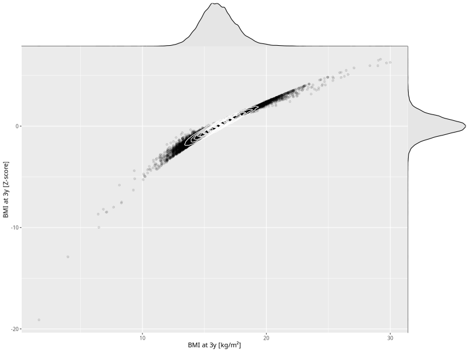

## BMI at 3y

| Name | # Children | # Mothers | # Fathers | # Total |
| ---- | ---------- | --------- | --------- | ------- |
| bmi_3y | 44125 | 41687 | 30761 | 116573 |
| z_bmi_3y | 44123 | 41685 | 30759 | 116567 |

- Formula: `bmi_3y ~ fp(pregnancy_duration_1)`
- Sigma formula: ` ~ pregnancy_duration_1`
- Distribution: `LOGNO`
- Normalization: `centiles.pred` Z-scores

