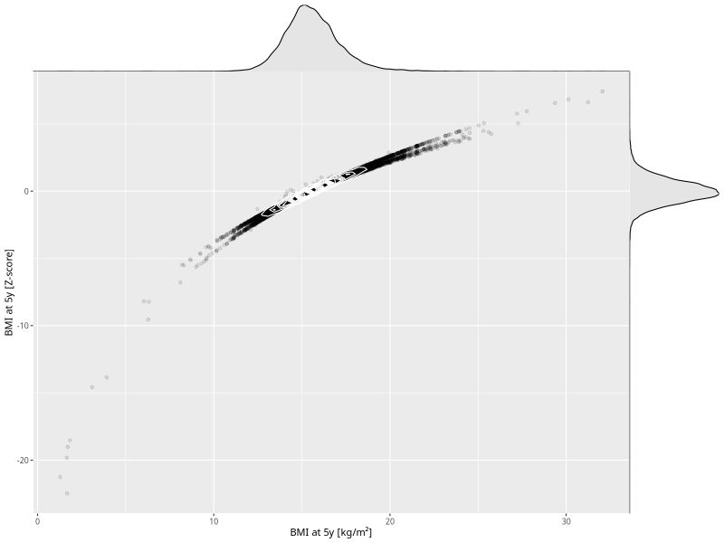

## BMI at 5y

| Name | # Children | # Mothers | # Fathers | # Total |
| ---- | ---------- | --------- | --------- | ------- |
| bmi_5y | 35670 | 33697 | 25393 | 94760 |
| z_bmi_5y | 35669 | 33696 | 25392 | 94757 |

- Formula: `bmi_5y ~ fp(pregnancy_duration_1)`
- Sigma formula: ` ~ pregnancy_duration_1`
- Distribution: `LOGNO`
- Normalization: `centiles.pred` Z-scores

