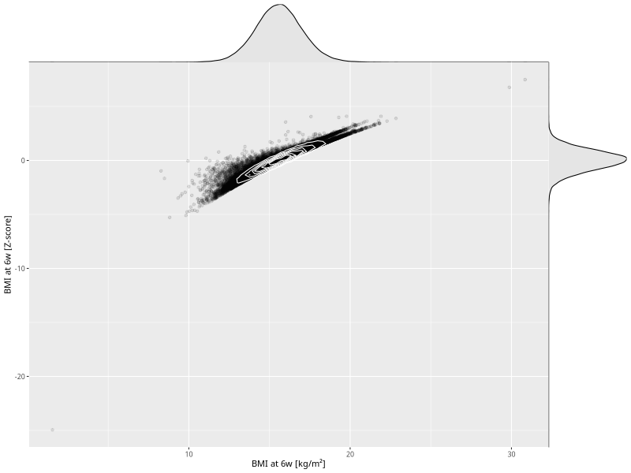

## BMI at 6w

| Name | # Children | # Mothers | # Fathers | # Total |
| ---- | ---------- | --------- | --------- | ------- |
| bmi_6w | 46631 | 44144 | 32519 | 123294 |
| z_bmi_6w | 46628 | 44141 | 32516 | 123285 |

- Formula: `bmi_6w ~ fp(pregnancy_duration_1)`
- Sigma formula: ` ~ pregnancy_duration_1`
- Distribution: `LOGNO`
- Normalization: `centiles.pred` Z-scores

