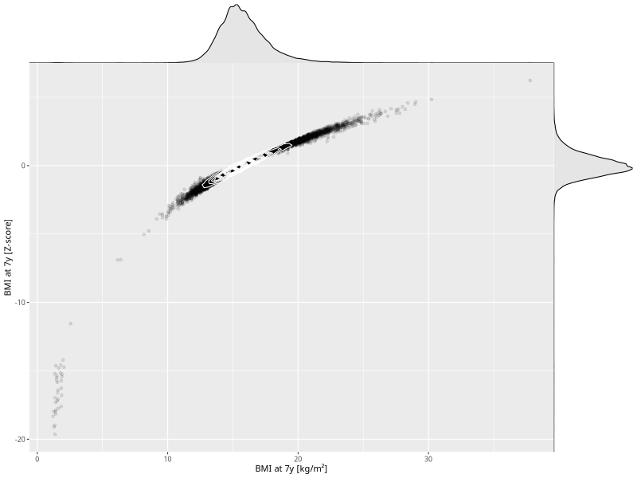

## BMI at 7y

| Name | # Children | # Mothers | # Fathers | # Total |
| ---- | ---------- | --------- | --------- | ------- |
| bmi_7y | 36865 | 34916 | 25152 | 96933 |
| z_bmi_7y | 36865 | 34916 | 25152 | 96933 |

- Formula: `bmi_7y ~ fp(pregnancy_duration_1)`
- Sigma formula: ` ~ pregnancy_duration_1`
- Distribution: `LOGNO`
- Normalization: `centiles.pred` Z-scores

