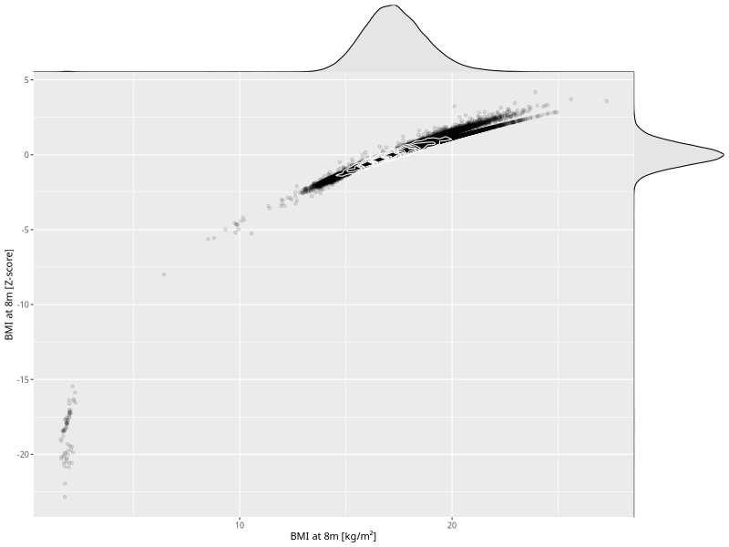

## BMI at 8m

| Name | # Children | # Mothers | # Fathers | # Total |
| ---- | ---------- | --------- | --------- | ------- |
| bmi_8m | 57964 | 54941 | 39107 | 152012 |
| z_bmi_8m | 57960 | 54937 | 39104 | 152001 |

- Formula: `bmi_8m ~ fp(pregnancy_duration_1)`
- Sigma formula: ` ~ pregnancy_duration_1`
- Distribution: `LOGNO`
- Normalization: `centiles.pred` Z-scores

