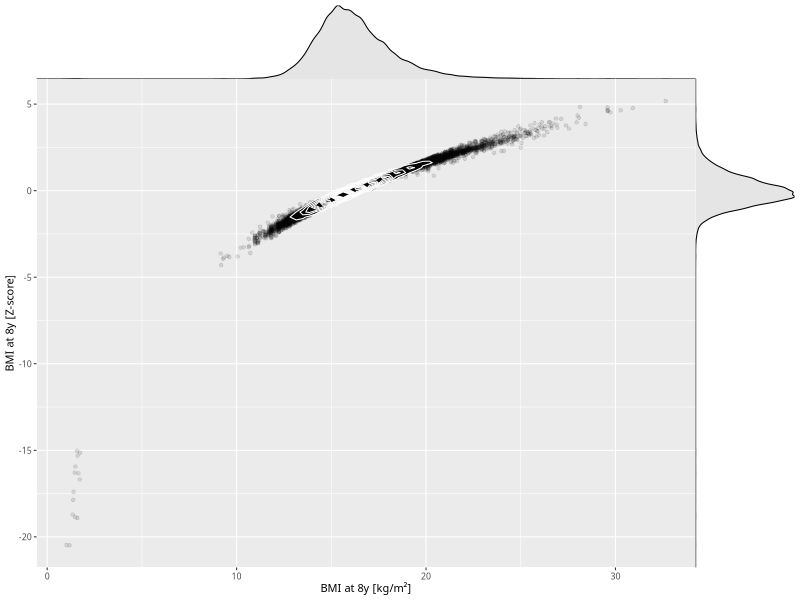

## BMI at 8y

| Name | # Children | # Mothers | # Fathers | # Total |
| ---- | ---------- | --------- | --------- | ------- |
| bmi_8y | 28122 | 26543 | 19823 | 74488 |
| z_bmi_8y | 28121 | 26542 | 19823 | 74486 |

- Formula: `bmi_8y ~ fp(pregnancy_duration_1)`
- Sigma formula: ` ~ pregnancy_duration_1`
- Distribution: `LOGNO`
- Normalization: `centiles.pred` Z-scores

