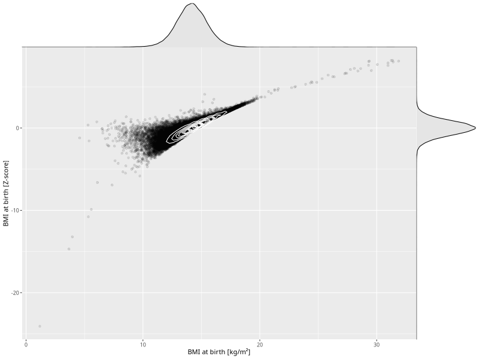

## BMI at birth

| Name | # Children | # Mothers | # Fathers | # Total |
| ---- | ---------- | --------- | --------- | ------- |
| bmi_birth | 78075 | 73858 | 51610 | 203543 |
| z_bmi_birth | 78052 | 73836 | 51599 | 203487 |

- Formula: `bmi_birth ~ fp(pregnancy_duration_1)`
- Sigma formula: ` ~ pregnancy_duration_1`
- Distribution: `LOGNO`
- Normalization: `centiles.pred` Z-scores

