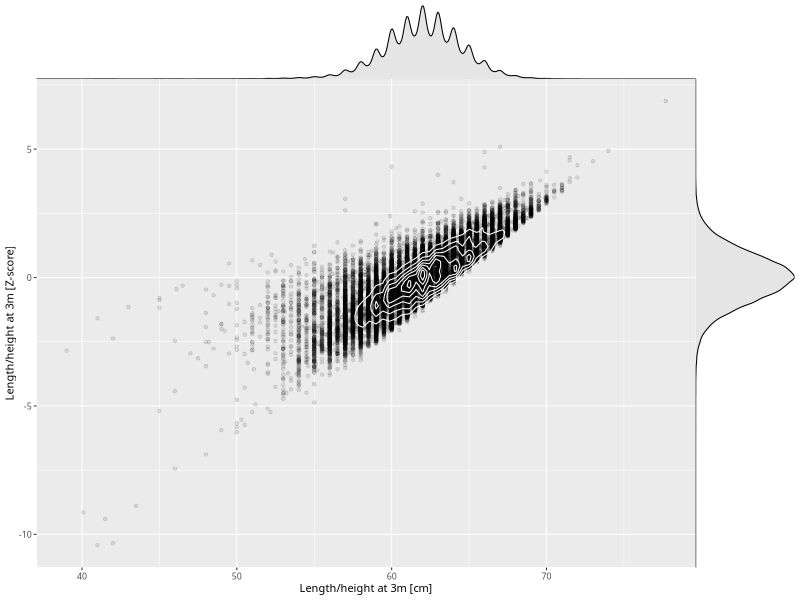

## Length/height at 3m

| Name | # Children | # Mothers | # Fathers | # Total |
| ---- | ---------- | --------- | --------- | ------- |
| length_3m | 65639 | 62212 | 44049 | 171900 |
| z_length_3m | 65638 | 62211 | 44048 | 171897 |

- Formula: `length_3m ~ fp(pregnancy_duration_1)`
- Sigma formula: ` ~ pregnancy_duration_1`
- Distribution: `NO`
- Normalization: `centiles.pred` Z-scores

