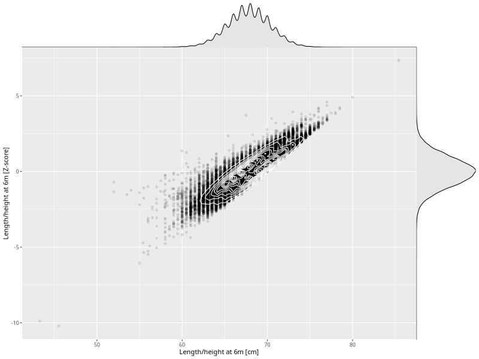

## Length/height at 6m

| Name | # Children | # Mothers | # Fathers | # Total |
| ---- | ---------- | --------- | --------- | ------- |
| length_6m | 66384 | 62913 | 44553 | 173850 |
| z_length_6m | 66383 | 62912 | 44552 | 173847 |

- Formula: `length_6m ~ fp(pregnancy_duration_1)`
- Sigma formula: ` ~ pregnancy_duration_1`
- Distribution: `NO`
- Normalization: `centiles.pred` Z-scores

