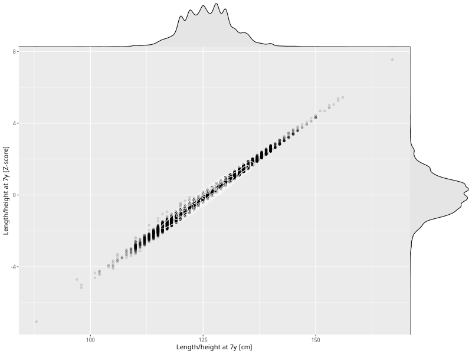

## Length/height at 7y

| Name | # Children | # Mothers | # Fathers | # Total |
| ---- | ---------- | --------- | --------- | ------- |
| length_7y | 38536 | 36505 | 26292 | 101333 |
| z_length_7y | 38534 | 36503 | 26290 | 101327 |

- Formula: `length_7y ~ fp(pregnancy_duration_1)`
- Sigma formula: ` ~ pregnancy_duration_1`
- Distribution: `NO`
- Normalization: `centiles.pred` Z-scores

