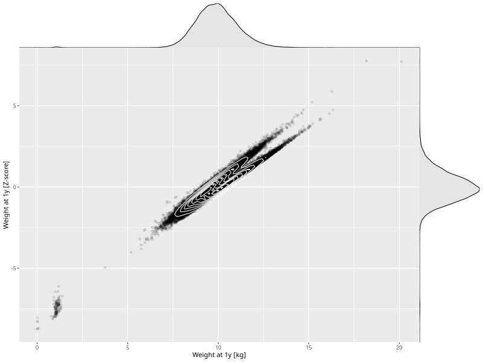

## Weight at 1y

| Name | # Children | # Mothers | # Fathers | # Total |
| ---- | ---------- | --------- | --------- | ------- |
| weight_1y | 58427 | 55373 | 39433 | 153233 |
| z_weight_1y | 58425 | 55371 | 39431 | 153227 |

- Formula: `weight_1y ~ fp(pregnancy_duration_1)`
- Sigma formula: ` ~ pregnancy_duration_1`
- Distribution: `NO`
- Normalization: `centiles.pred` Z-scores

