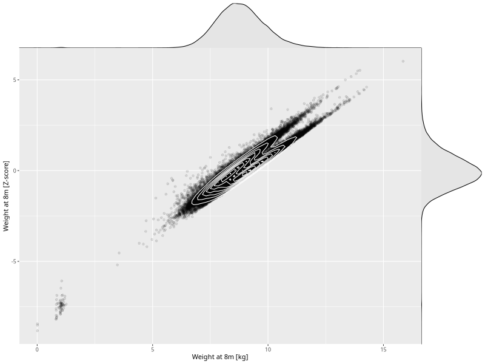

## Weight at 8m

| Name | # Children | # Mothers | # Fathers | # Total |
| ---- | ---------- | --------- | --------- | ------- |
| weight_8m | 58531 | 55479 | 39490 | 153500 |
| z_weight_8m | 58529 | 55477 | 39488 | 153494 |

- Formula: `weight_8m ~ fp(pregnancy_duration_1)`
- Sigma formula: ` ~ pregnancy_duration_1`
- Distribution: `NO`
- Normalization: `centiles.pred` Z-scores

