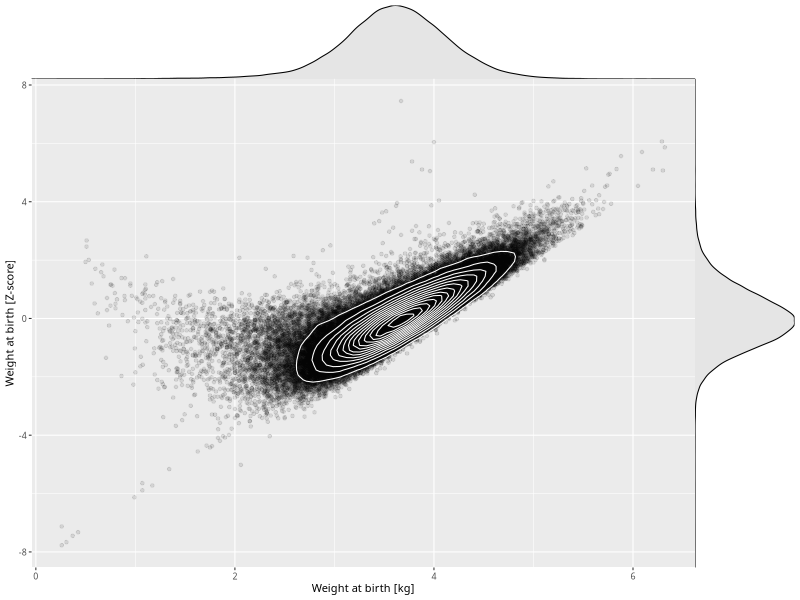

## Weight at birth

| Name | # Children | # Mothers | # Fathers | # Total |
| ---- | ---------- | --------- | --------- | ------- |
| weight_birth | 80829 | 76456 | 53488 | 210773 |
| z_weight_birth | 80828 | 76455 | 53487 | 210770 |

- Formula: `weight_birth ~ fp(pregnancy_duration_1)`
- Sigma formula: ` ~ pregnancy_duration_1`
- Distribution: `NO`
- Normalization: `centiles.pred` Z-scores

