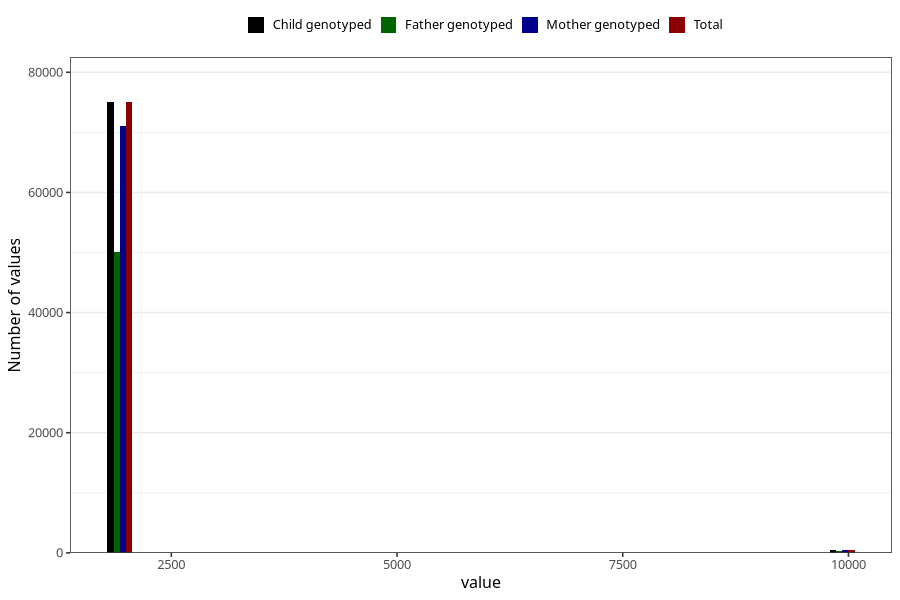

# q1_year_filled
Variable mapping to `AA11` in `Skjema1_v12`.
- Number of values:

| Value | Total | Child genotyped | Mother genotyped | Father genotyped |
| ----- | ----- | --------------- | ---------------- | ---------------- |
| Missing | 5543 | 5543 | 5190 | 3166 |
| Non-missing | 75462 | 75462 | 71427 | 50438 |
| 1999 | 566 | 566 | 544 | 101 |
| 2000 | 1946 | 1946 | 1886 | 500 |
| 2001 | 4293 | 4293 | 4169 | 1804 |
| 2002 | 7657 | 7657 | 7290 | 4811 |
| 2003 | 9531 | 9531 | 9047 | 6422 |
| 2004 | 10291 | 10291 | 9760 | 7267 |
| 2005 | 12336 | 12336 | 11605 | 8883 |
| 2006 | 10947 | 10947 | 10274 | 7938 |
| 2007 | 10615 | 10615 | 9968 | 7435 |
| 2008 | 6770 | 6770 | 6397 | 4947 |
| 2009 | 65 | 65 | 63 | 48 |
| 2044 | 1 | 1 | 1 | 0 |
| 9999 | 444 | 444 | 423 | 282 |

