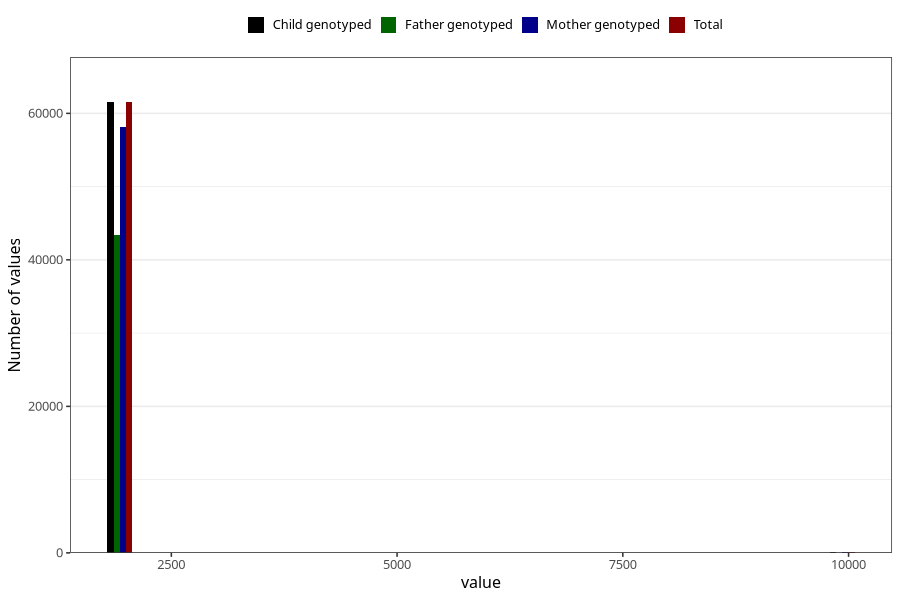

# q2_year_filled
Variable mapping to `BB11` in `Skjema2CDW_v12`.
- Number of values:

| Value | Total | Child genotyped | Mother genotyped | Father genotyped |
| ----- | ----- | --------------- | ---------------- | ---------------- |
| Missing | 19408 | 19408 | 18432 | 10231 |
| Non-missing | 61597 | 61597 | 58185 | 43373 |
| 2000 | 2 | 2 | 2 | 1 |
| 2001 | 51 | 51 | 47 | 34 |
| 2002 | 5997 | 5997 | 5699 | 3862 |
| 2003 | 8773 | 8773 | 8331 | 5917 |
| 2004 | 8711 | 8711 | 8272 | 6156 |
| 2005 | 10861 | 10861 | 10219 | 7837 |
| 2006 | 10373 | 10373 | 9797 | 7569 |
| 2007 | 9434 | 9434 | 8823 | 6585 |
| 2008 | 6811 | 6811 | 6442 | 5005 |
| 2009 | 509 | 509 | 481 | 360 |
| 9999 | 75 | 75 | 72 | 47 |

