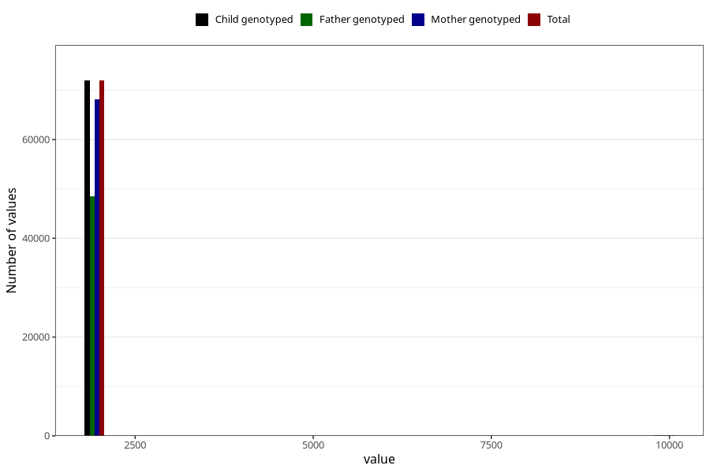

# q3_year_filled
Variable mapping to `CC11` in `Skjema3_v12`.
- Number of values:

| Value | Total | Child genotyped | Mother genotyped | Father genotyped |
| ----- | ----- | --------------- | ---------------- | ---------------- |
| Missing | 8965 | 8965 | 8384 | 5102 |
| Non-missing | 72040 | 72040 | 68233 | 48502 |
| 2000 | 1196 | 1196 | 1163 | 247 |
| 2001 | 3484 | 3484 | 3382 | 1318 |
| 2002 | 6690 | 6690 | 6404 | 3980 |
| 2003 | 9094 | 9094 | 8645 | 6022 |
| 2004 | 10129 | 10129 | 9630 | 7168 |
| 2005 | 11071 | 11071 | 10415 | 7976 |
| 2006 | 10959 | 10959 | 10341 | 8017 |
| 2007 | 10156 | 10156 | 9476 | 7065 |
| 2008 | 7929 | 7929 | 7528 | 5749 |
| 2009 | 1232 | 1232 | 1155 | 898 |
| 9999 | 100 | 100 | 94 | 62 |

