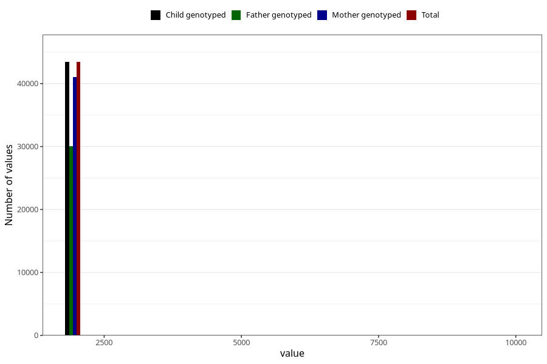

# q3y_year_filled
Variable mapping to `GG11` in `Skjema6_3aar_v12`.
- Number of values:

| Value | Total | Child genotyped | Mother genotyped | Father genotyped |
| ----- | ----- | --------------- | ---------------- | ---------------- |
| Missing | 37561 | 37561 | 35528 | 23502 |
| Non-missing | 43444 | 43444 | 41089 | 30102 |
| 2001 | 5 | 5 | 3 | 2 |
| 2002 | 16 | 16 | 15 | 10 |
| 2003 | 17 | 17 | 17 | 11 |
| 2004 | 820 | 820 | 793 | 321 |
| 2005 | 3785 | 3785 | 3638 | 2137 |
| 2006 | 5989 | 5989 | 5695 | 4015 |
| 2007 | 6255 | 6255 | 5945 | 4398 |
| 2008 | 6584 | 6584 | 6187 | 4713 |
| 2009 | 7169 | 7169 | 6771 | 5314 |
| 2010 | 6061 | 6061 | 5637 | 4278 |
| 2011 | 5275 | 5275 | 5011 | 3830 |
| 2012 | 1450 | 1450 | 1359 | 1062 |
| 2013 | 5 | 5 | 5 | 2 |
| 2014 | 1 | 1 | 1 | 1 |
| 9999 | 12 | 12 | 12 | 8 |

