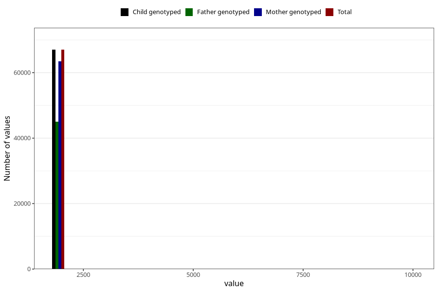

# q4_year_filled
Variable mapping to `DD11` in `Skjema4_6mnd_v12`.
- Number of values:

| Value | Total | Child genotyped | Mother genotyped | Father genotyped |
| ----- | ----- | --------------- | ---------------- | ---------------- |
| Missing | 13948 | 13948 | 13082 | 8614 |
| Non-missing | 67057 | 67057 | 63535 | 44990 |
| 2000 | 642 | 642 | 618 | 120 |
| 2001 | 1793 | 1793 | 1745 | 478 |
| 2002 | 4055 | 4055 | 3930 | 1765 |
| 2003 | 7124 | 7124 | 6794 | 4546 |
| 2004 | 8904 | 8904 | 8464 | 6056 |
| 2005 | 9152 | 9152 | 8675 | 6489 |
| 2006 | 10918 | 10918 | 10269 | 7955 |
| 2007 | 9558 | 9558 | 8995 | 6909 |
| 2008 | 9197 | 9197 | 8638 | 6473 |
| 2009 | 5640 | 5640 | 5337 | 4154 |
| 2010 | 22 | 22 | 21 | 15 |
| 2022 | 1 | 1 | 1 | 1 |
| 2066 | 1 | 1 | 1 | 1 |
| 9999 | 50 | 50 | 47 | 28 |

