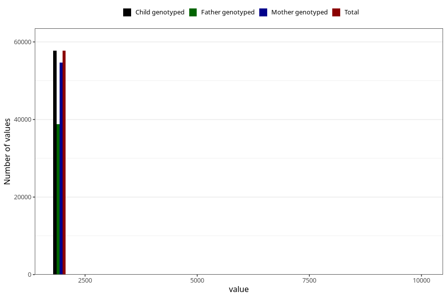

# q5_year_filled
Variable mapping to `EE11` in `Skjema5_18mnd_v12`.
- Number of values:

| Value | Total | Child genotyped | Mother genotyped | Father genotyped |
| ----- | ----- | --------------- | ---------------- | ---------------- |
| Missing | 23240 | 23240 | 21876 | 14814 |
| Non-missing | 57765 | 57765 | 54741 | 38790 |
| 2000 | 7 | 7 | 7 | 3 |
| 2001 | 387 | 387 | 374 | 90 |
| 2002 | 1761 | 1761 | 1713 | 452 |
| 2003 | 3587 | 3587 | 3479 | 1562 |
| 2004 | 6188 | 6188 | 5890 | 3945 |
| 2005 | 7895 | 7895 | 7499 | 5397 |
| 2006 | 7683 | 7683 | 7291 | 5453 |
| 2007 | 9351 | 9351 | 8796 | 6851 |
| 2008 | 8238 | 8238 | 7755 | 5973 |
| 2009 | 7853 | 7853 | 7387 | 5546 |
| 2010 | 4737 | 4737 | 4480 | 3470 |
| 2011 | 40 | 40 | 34 | 28 |
| 9999 | 38 | 38 | 36 | 20 |

