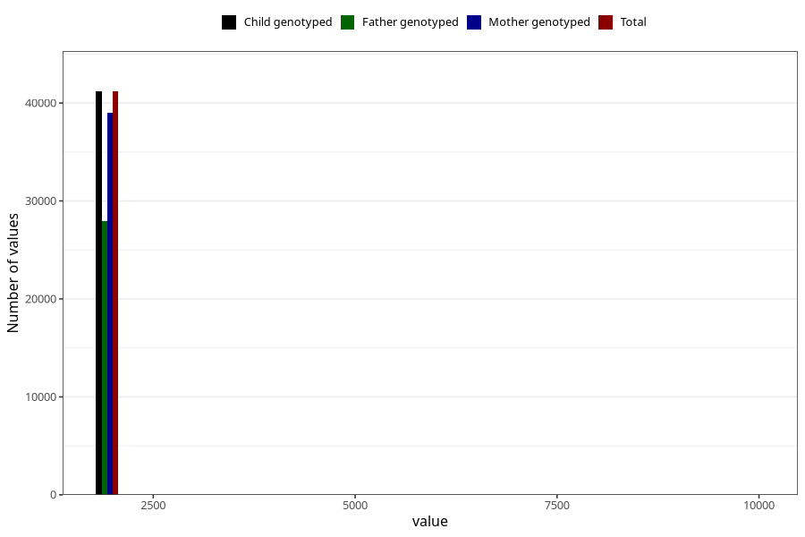

# q7y_year_filled
Variable mapping to `JJ11` in `Skjema7aar_v12`.
- Number of values:

| Value | Total | Child genotyped | Mother genotyped | Father genotyped |
| ----- | ----- | --------------- | ---------------- | ---------------- |
| Missing | 39820 | 39820 | 37626 | 25677 |
| Non-missing | 41185 | 41185 | 38991 | 27927 |
| 25th percentile | 2011 | 2011 | 2010 | 2011 |
| 50th percentile | 2012 | 2012 | 2012 | 2013 |
| 75th percentile | 2014 | 2014 | 2014 | 2014 |
| Mean | 2013.75464368095 | 2013.75464368095 | 2013.61998922828 | 2014.13707165109 |
| Standard deviation | 111.327089709232 | 111.327089709232 | 107.029847054754 | 117.073753739746 |
| N | 41185 | 41185 | 38991 | 27927 |

