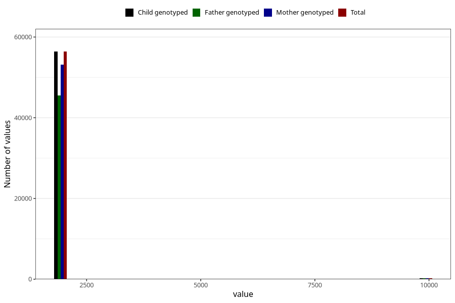

# qFar_year_filled
Variable mapping to `FF11` in `SkjemaFar_v12`.
- Number of values:

| Value | Total | Child genotyped | Mother genotyped | Father genotyped |
| ----- | ----- | --------------- | ---------------- | ---------------- |
| Missing | 24333 | 24333 | 23145 | 7910 |
| Non-missing | 56672 | 56672 | 53472 | 45694 |
| 2000 | 4 | 4 | 4 | 3 |
| 2001 | 968 | 968 | 929 | 788 |
| 2002 | 5348 | 5348 | 5066 | 4285 |
| 2003 | 7554 | 7554 | 7164 | 6019 |
| 2004 | 8522 | 8522 | 8067 | 6870 |
| 2005 | 10452 | 10452 | 9827 | 8415 |
| 2006 | 9139 | 9139 | 8587 | 7498 |
| 2007 | 8675 | 8675 | 8141 | 6890 |
| 2008 | 5644 | 5644 | 5340 | 4634 |
| 2009 | 84 | 84 | 83 | 67 |
| 9999 | 282 | 282 | 264 | 225 |

