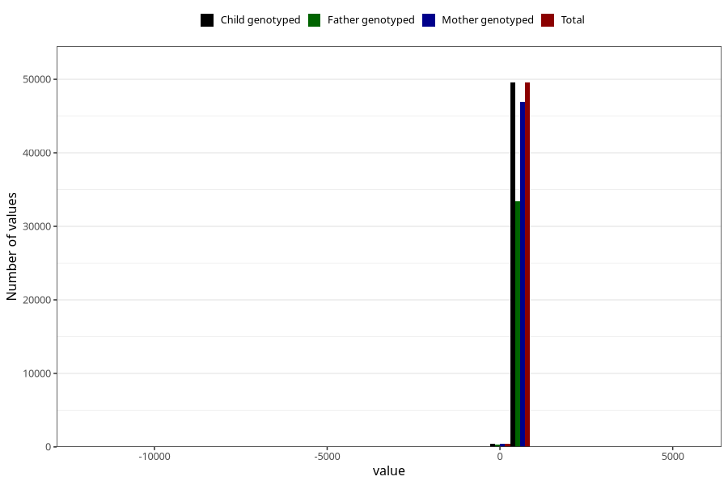

# age_15_18m_1
Variable mapping to `Q5_AGE_15_18_M` in `Skjema5_18mnd_v12`.
- Number of values:

| Value | Total | Child genotyped | Mother genotyped | Father genotyped |
| ----- | ----- | --------------- | ---------------- | ---------------- |
| Missing | 31009 | 31009 | 29209 | 19847 |
| Non-missing | 49996 | 49996 | 47408 | 33757 |
| 25th percentile | 461 | 461 | 461 | 460 |
| 50th percentile | 474 | 474 | 474 | 473 |
| 75th percentile | 512 | 512 | 512 | 511 |
| Mean | 485.173553884311 | 485.173553884311 | 485.368714141073 | 484.89883579702 |
| Standard deviation | 108.384809213034 | 108.384809213034 | 102.011319665534 | 83.3909452808642 |
| N | 49996 | 49996 | 47408 | 33757 |

