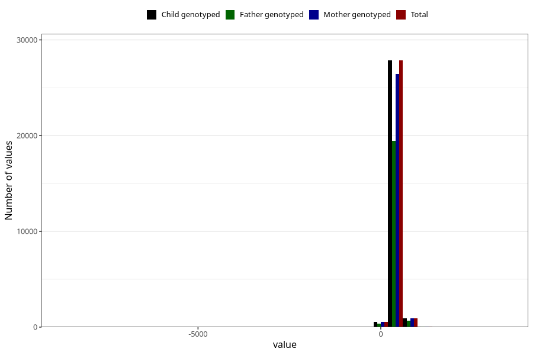

# age_15_18m_2
Variable mapping to `Q6_AGE_18_M` in `Skjema6_3aar_v12`.
- Number of values:

| Value | Total | Child genotyped | Mother genotyped | Father genotyped |
| ----- | ----- | --------------- | ---------------- | ---------------- |
| Missing | 51559 | 51559 | 48676 | 33078 |
| Non-missing | 29446 | 29446 | 27941 | 20526 |
| 25th percentile | 459 | 459 | 459 | 459 |
| 50th percentile | 474 | 474 | 474 | 473 |
| 75th percentile | 527 | 527 | 527 | 523 |
| Mean | 488.464647150717 | 488.464647150717 | 488.291471314556 | 487.598801520023 |
| Standard deviation | 111.572372862035 | 111.572372862035 | 112.052246202123 | 116.283162965696 |
| N | 29446 | 29446 | 27941 | 20526 |

