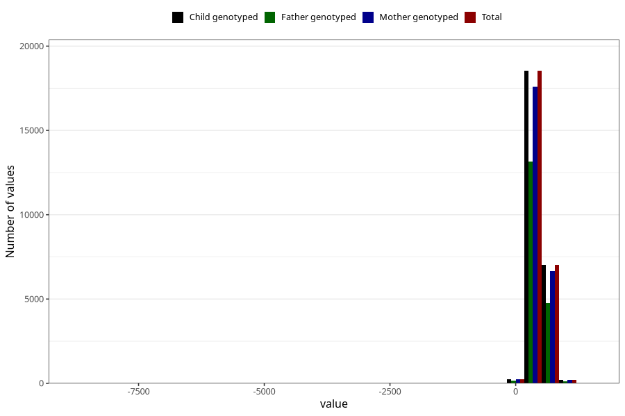

# age_16m
Variable created during phenotype curation.
- Number of values:

| Value | Total | Child genotyped | Mother genotyped | Father genotyped |
| ----- | ----- | --------------- | ---------------- | ---------------- |
| Missing | 54985 | 54985 | 51916 | 35394 |
| Non-missing | 26020 | 26020 | 24701 | 18210 |
| 25th percentile | 460 | 460 | 460 | 459.25 |
| 50th percentile | 474 | 474 | 474 | 473 |
| 75th percentile | 527 | 527 | 527 | 523 |
| Mean | 489.245849346656 | 489.245849346656 | 489.15914335452 | 488.468314113125 |
| Standard deviation | 108.133719066673 | 108.133719066673 | 108.762081725918 | 113.994292783724 |
| N | 26020 | 26020 | 24701 | 18210 |

