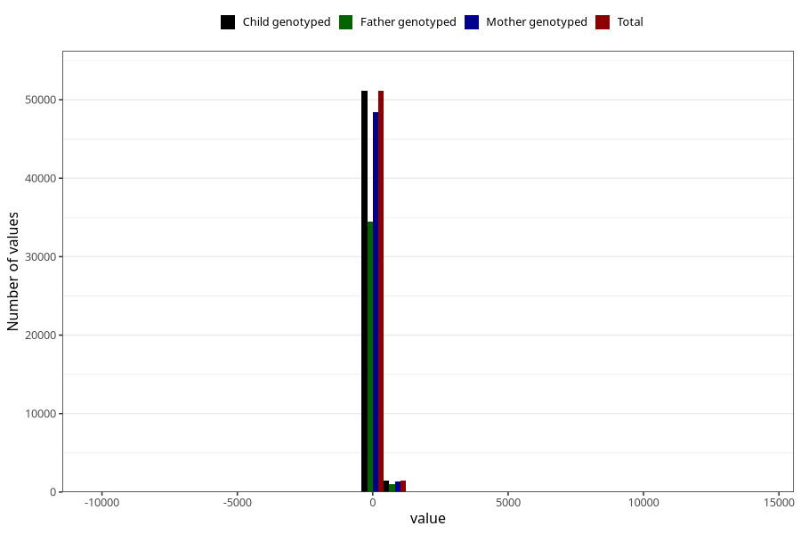

# age_1y
Variable mapping to `Q5_AGE_1_Y` in `Skjema5_18mnd_v12`.
- Number of values:

| Value | Total | Child genotyped | Mother genotyped | Father genotyped |
| ----- | ----- | --------------- | ---------------- | ---------------- |
| Missing | 28414 | 28414 | 26760 | 18161 |
| Non-missing | 52591 | 52591 | 49857 | 35443 |
| 25th percentile | 363 | 363 | 363 | 363 |
| 50th percentile | 369 | 369 | 369 | 369 |
| 75th percentile | 377 | 377 | 377 | 377 |
| Mean | 370.505086421631 | 370.505086421631 | 370.549852578374 | 370.886070592219 |
| Standard deviation | 89.2298318393654 | 89.2298318393654 | 91.1558839843102 | 84.7514987715086 |
| N | 52591 | 52591 | 49857 | 35443 |

