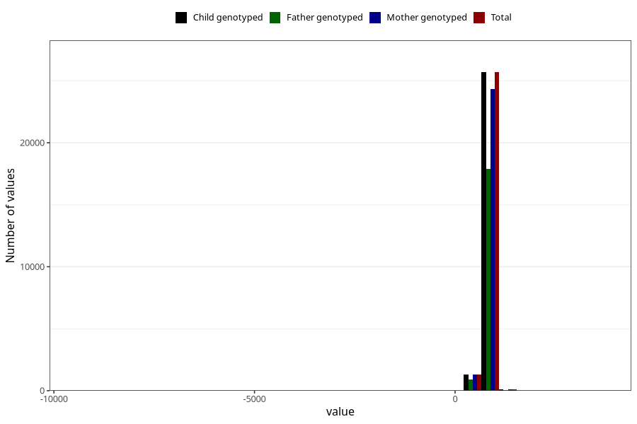

# age_2y
Variable mapping to `Q6_AGE_2_Y` in `Skjema6_3aar_v12`.
- Number of values:

| Value | Total | Child genotyped | Mother genotyped | Father genotyped |
| ----- | ----- | --------------- | ---------------- | ---------------- |
| Missing | 53873 | 53873 | 50905 | 34749 |
| Non-missing | 27132 | 27132 | 25712 | 18855 |
| 25th percentile | 734 | 734 | 734 | 734 |
| 50th percentile | 759 | 759 | 759 | 760 |
| 75th percentile | 806 | 806 | 806 | 808 |
| Mean | 767.906567890314 | 767.906567890314 | 767.723708774113 | 769.396234420578 |
| Standard deviation | 113.283388444372 | 113.283388444372 | 114.532876636799 | 92.1023157809858 |
| N | 27132 | 27132 | 25712 | 18855 |

