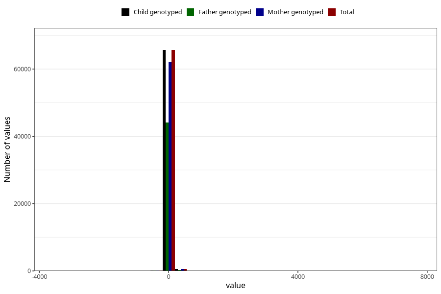

# age_3m
Variable mapping to `ALDER3MND_SJEKK` in `Skjema4_6mnd_v12`.
- Number of values:

| Value | Total | Child genotyped | Mother genotyped | Father genotyped |
| ----- | ----- | --------------- | ---------------- | ---------------- |
| Missing | 14632 | 14632 | 13718 | 9061 |
| Non-missing | 66373 | 66373 | 62899 | 44543 |
| 25th percentile | 90 | 90 | 90 | 90 |
| 50th percentile | 94 | 94 | 94 | 94 |
| 75th percentile | 99 | 99 | 99 | 98 |
| Mean | 95.8695101923975 | 95.8695101923975 | 95.9209844353646 | 95.7333363266956 |
| Standard deviation | 62.3426921475519 | 62.3426921475519 | 62.8354446012181 | 64.9772773788393 |
| N | 66373 | 66373 | 62899 | 44543 |

