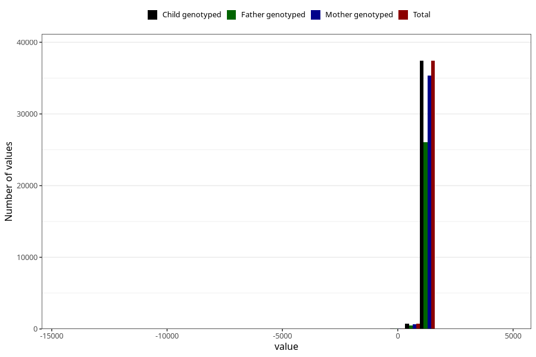

# age_3y
Variable mapping to `Q6_AGE_3_Y` in `Skjema6_3aar_v12`.
- Number of values:

| Value | Total | Child genotyped | Mother genotyped | Father genotyped |
| ----- | ----- | --------------- | ---------------- | ---------------- |
| Missing | 42774 | 42774 | 40482 | 26989 |
| Non-missing | 38231 | 38231 | 36135 | 26615 |
| 25th percentile | 1096 | 1096 | 1096 | 1096 |
| 50th percentile | 1103 | 1103 | 1103 | 1103 |
| 75th percentile | 1119 | 1119 | 1119 | 1119 |
| Mean | 1096.8738719887 | 1096.8738719887 | 1096.95392278954 | 1098.04050347548 |
| Standard deviation | 173.686094958005 | 173.686094958005 | 177.058501689312 | 154.064106597893 |
| N | 38231 | 38231 | 36135 | 26615 |

