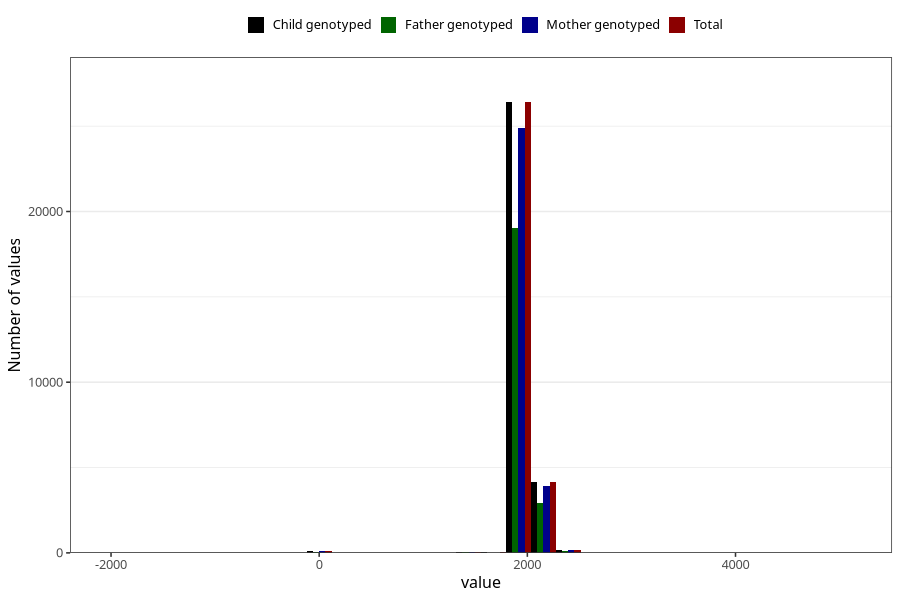

# age_5y
Variable mapping to `AGE_MTHS_Q5AAR` in `Skjema5aar_v12`.
- Number of values:

| Value | Total | Child genotyped | Mother genotyped | Father genotyped |
| ----- | ----- | --------------- | ---------------- | ---------------- |
| Missing | 50085 | 50085 | 47438 | 31362 |
| Non-missing | 30920 | 30920 | 29179 | 22242 |
| 25th percentile | 1826.25 | 1826.25 | 1826.25 | 1826.25 |
| 50th percentile | 1856.6875 | 1856.6875 | 1856.6875 | 1856.6875 |
| 75th percentile | 1948 | 1948 | 1948 | 1948 |
| Mean | 1898.57450072768 | 1898.57450072768 | 1899.0062544981 | 1898.23560437461 |
| Standard deviation | 162.06640076838 | 162.06640076838 | 161.090657187856 | 162.23097319582 |
| N | 30920 | 30920 | 29179 | 22242 |

