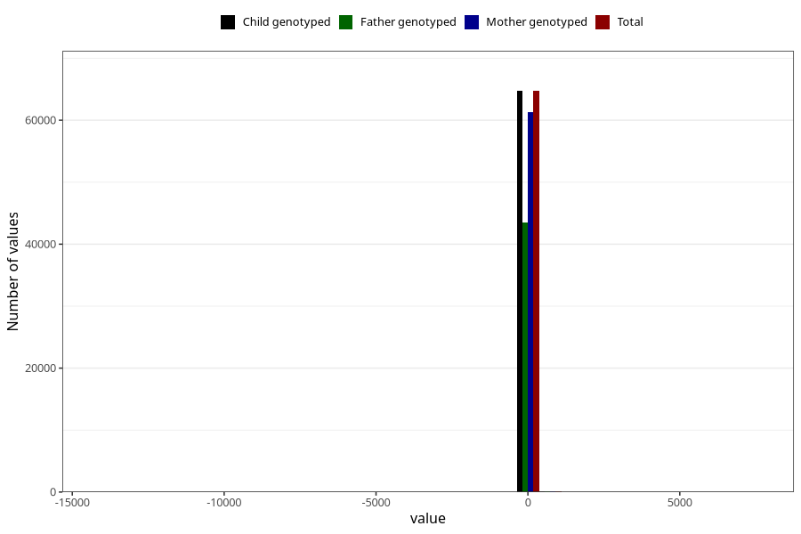

# age_6m
Variable mapping to `ALDER6MND_SJEKK` in `Skjema4_6mnd_v12`.
- Number of values:

| Value | Total | Child genotyped | Mother genotyped | Father genotyped |
| ----- | ----- | --------------- | ---------------- | ---------------- |
| Missing | 16127 | 16127 | 15143 | 10016 |
| Non-missing | 64878 | 64878 | 61474 | 43588 |
| 25th percentile | 167 | 167 | 167 | 167 |
| 50th percentile | 181 | 181 | 181 | 181 |
| 75th percentile | 187 | 187 | 187 | 187 |
| Mean | 172.683914423996 | 172.683914423996 | 172.637228747113 | 172.111383867119 |
| Standard deviation | 124.417195730896 | 124.417195730896 | 127.311176966356 | 134.494893803801 |
| N | 64878 | 64878 | 61474 | 43588 |

