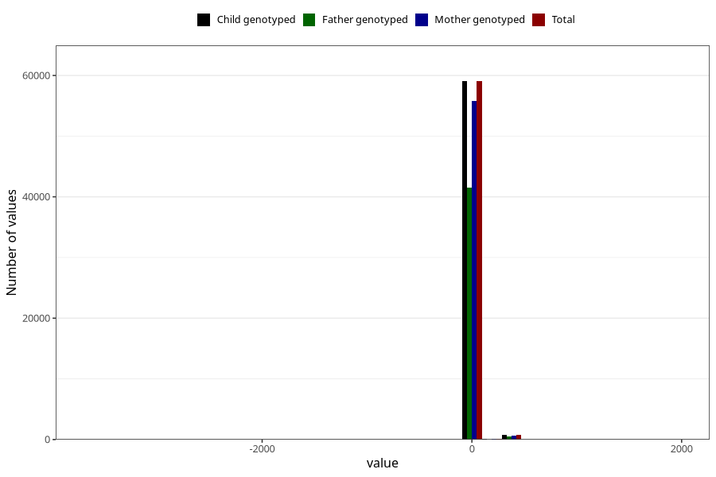

# age_6w
Variable mapping to `ALDER6UK_SJEKK` in `Skjema4_6mnd_v12`.
- Number of values:

| Value | Total | Child genotyped | Mother genotyped | Father genotyped |
| ----- | ----- | --------------- | ---------------- | ---------------- |
| Missing | 21056 | 21056 | 19949 | 11414 |
| Non-missing | 59949 | 59949 | 56668 | 42190 |
| 25th percentile | 40 | 40 | 40 | 40 |
| 50th percentile | 44 | 44 | 44 | 44 |
| 75th percentile | 48 | 48 | 48 | 48 |
| Mean | 46.7780780329947 | 46.7780780329947 | 46.8135455636338 | 46.7827210239393 |
| Standard deviation | 60.4029724078332 | 60.4029724078332 | 60.0272671617546 | 60.1159086496113 |
| N | 59949 | 59949 | 56668 | 42190 |

