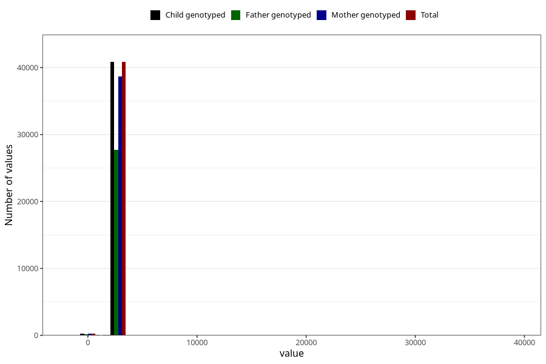

# age_7y
Variable mapping to `AGE_MTHS_Q7` in `Skjema7aar_v12`.
- Number of values:

| Value | Total | Child genotyped | Mother genotyped | Father genotyped |
| ----- | ----- | --------------- | ---------------- | ---------------- |
| Missing | 39893 | 39893 | 37695 | 25723 |
| Non-missing | 41112 | 41112 | 38922 | 27881 |
| 25th percentile | 2556.75 | 2556.75 | 2556.75 | 2556.75 |
| 50th percentile | 2587.1875 | 2587.1875 | 2587.1875 | 2587.1875 |
| 75th percentile | 2617.625 | 2617.625 | 2617.625 | 2617.625 |
| Mean | 2590.66643102987 | 2590.66643102987 | 2590.72767168953 | 2586.89820128403 |
| Standard deviation | 281.090193484519 | 281.090193484519 | 285.915131142568 | 300.365652512575 |
| N | 41112 | 41112 | 38922 | 27881 |

