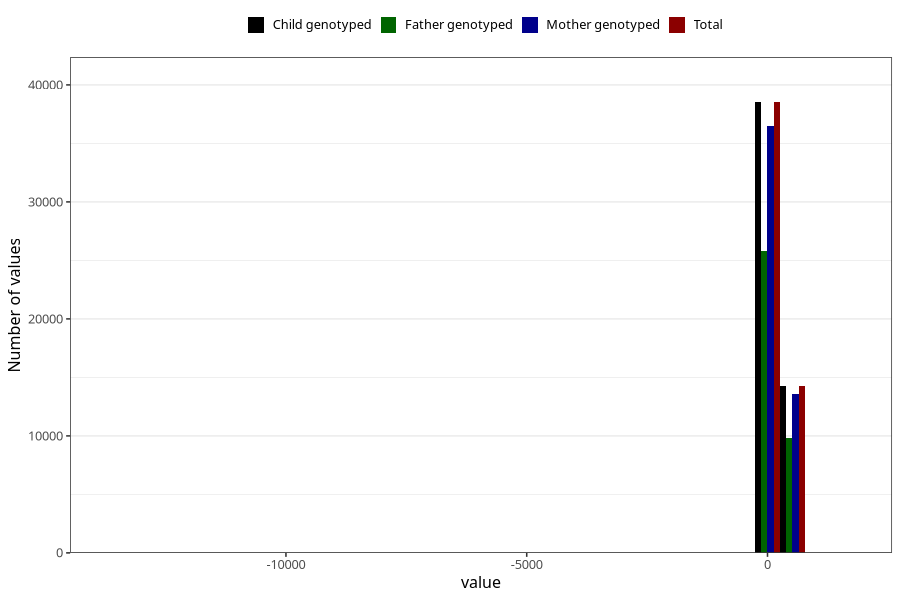

# age_8m
Variable mapping to `Q5_AGE_8_M` in `Skjema5_18mnd_v12`.
- Number of values:

| Value | Total | Child genotyped | Mother genotyped | Father genotyped |
| ----- | ----- | --------------- | ---------------- | ---------------- |
| Missing | 28169 | 28169 | 26517 | 18001 |
| Non-missing | 52836 | 52836 | 50100 | 35603 |
| 25th percentile | 234 | 234 | 234 | 234 |
| 50th percentile | 246 | 246 | 246 | 246 |
| 75th percentile | 260 | 260 | 260 | 261 |
| Mean | 249.930672268908 | 249.930672268908 | 250.048922155689 | 250.74176333455 |
| Standard deviation | 87.3585911167011 | 87.3585911167011 | 87.9572110137462 | 66.0135528717127 |
| N | 52836 | 52836 | 50100 | 35603 |

