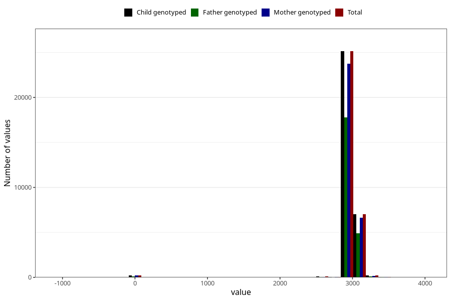

# age_8y
Variable mapping to `AGE_MTHS_Q8AAR` in `Skjema8aar_v12`.
- Number of values:

| Value | Total | Child genotyped | Mother genotyped | Father genotyped |
| ----- | ----- | --------------- | ---------------- | ---------------- |
| Missing | 48253 | 48253 | 45700 | 30567 |
| Non-missing | 32752 | 32752 | 30917 | 23037 |
| 25th percentile | 2922 | 2922 | 2922 | 2922 |
| 50th percentile | 2952.4375 | 2952.4375 | 2952.4375 | 2952.4375 |
| 75th percentile | 2982.875 | 2982.875 | 2982.875 | 2982.875 |
| Mean | 2950.59463353383 | 2950.59463353383 | 2950.16923335058 | 2952.05962419152 |
| Standard deviation | 250.303763063865 | 250.303763063865 | 253.113624321663 | 238.441411473071 |
| N | 32752 | 32752 | 30917 | 23037 |

