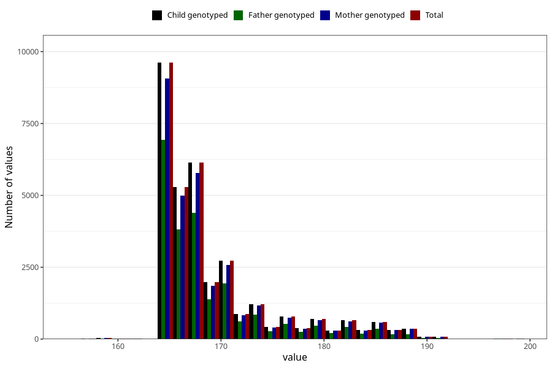

# age_answering_q_13
Variable mapping to `AGE_MTHS_KOST` in `Kosthold_ungdom_v12`.
- Number of values:

| Value | Total | Child genotyped | Mother genotyped | Father genotyped |
| ----- | ----- | --------------- | ---------------- | ---------------- |
| Missing | 48037 | 48037 | 45444 | 30490 |
| Non-missing | 32968 | 32968 | 31173 | 23114 |
| 25th percentile | 165 | 165 | 165 | 165 |
| 50th percentile | 167 | 167 | 167 | 167 |
| 75th percentile | 171 | 171 | 171 | 170 |
| Mean | 169.186817520019 | 169.186817520019 | 169.227921598819 | 168.879120879121 |
| Standard deviation | 6.07320382837007 | 6.07320382837007 | 6.11482164830616 | 5.7090213250567 |
| N | 32968 | 32968 | 31173 | 23114 |

