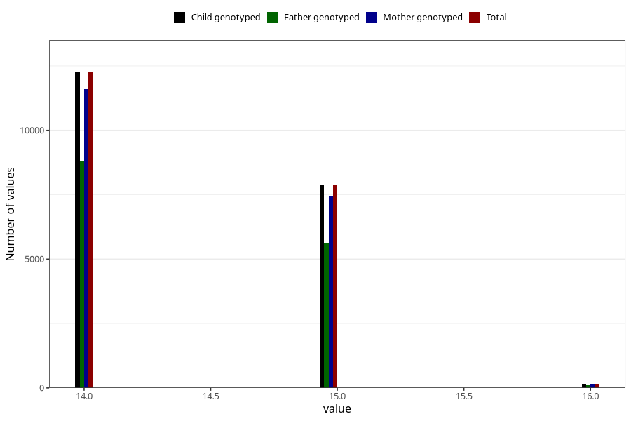

# age_answering_q_14c
Variable mapping to `AGE_YRS_UB` in `Ungdomsskjema_Barn_v12_standard`.
- Number of values:

| Value | Total | Child genotyped | Mother genotyped | Father genotyped |
| ----- | ----- | --------------- | ---------------- | ---------------- |
| Missing | 60688 | 60688 | 57402 | 39038 |
| Non-missing | 20317 | 20317 | 19215 | 14566 |
| 14 | 12275 | 12275 | 11597 | 8810 |
| 15 | 7873 | 7873 | 7458 | 5642 |
| 16 | 169 | 169 | 160 | 114 |

