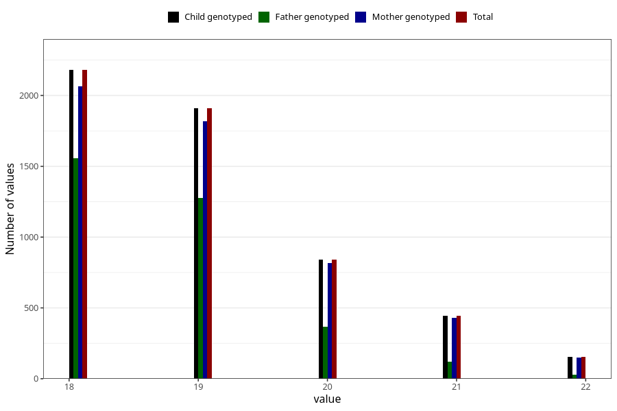

# age_answering_q_18
Variable mapping to `AGE_YRS_VE` in `18-aarsskjema_v12_standard`.
- Number of values:

| Value | Total | Child genotyped | Mother genotyped | Father genotyped |
| ----- | ----- | --------------- | ---------------- | ---------------- |
| Missing | 75479 | 75479 | 71338 | 50258 |
| Non-missing | 5526 | 5526 | 5279 | 3346 |
| 18 | 2180 | 2180 | 2066 | 1557 |
| 19 | 1910 | 1910 | 1819 | 1276 |
| 20 | 840 | 840 | 818 | 365 |
| 21 | 443 | 443 | 429 | 119 |
| 22 | 153 | 153 | 147 | 29 |

